# VITGPA — VIT Chennai GPA Calculator

A fast, privacy-first GPA tool for VIT Chennai students. Works fully without any login, and optionally connects to VTOP to pull your actual grades, marks, and semester history automatically.

---

## Features

### GPA Calculator
Calculate your semester GPA by entering course credits and expected or actual grades. When connected to VTOP, pick a semester from the dropdown and all registered courses and grades are pre-filled from your grade history. You can still edit any row manually. The result updates in real time with a breakdown of each course's weighted contribution, a progress ring, and a motivational label.

### CGPA Calculator
Computes your updated cumulative GPA after factoring in the current semester. There is also a target calculator — enter a desired final CGPA and it tells you what GPA you need this semester, with a feasibility label (safe target, achievable, challenging, very difficult, not achievable). When VTOP is connected, credits done, CGPA so far, and credits this semester are all auto-filled from your grade history and timetable.

### Analytics
A full dashboard of your academic history sourced from your VTOP grade history:

- **GPA Trend** — area chart of SGPA per semester, sorted chronologically (fall before winter within each academic year), with a zoomed Y-axis that shows only the range your actual values occupy rather than a fixed 0–10 scale
- **Grade Heatmap** — how many times you received each grade (S through F) per semester, sorted by year and season
- **Credit Progress** — credits completed out of your total program requirement, pulled dynamically from VTOP (not a hardcoded number)
- **VTOP Data Log** — a collapsible card showing exactly what was fetched from each VTOP endpoint, so you can verify what the app knows about you

### Grade Predictor *(experimental)*
Predicts your final grade using a skew-normal bell curve model based on class statistics. Works in two modes which are always accessible via tab buttons regardless of whether you are connected to VTOP:

**Theory mode** — enter CAT 1, CAT 2, and internals (auto-filled from VTOP when connected and a course is selected). Use the FAT slider to simulate expected exam marks, or toggle "FAT completed" to enter actual marks. The model estimates grade boundaries from the class mean and standard deviation you provide.

**Lab mode** — enter total lab internal marks (out of 60) and FAT marks. Uses VIT's fixed threshold grading scheme (no bell curve needed).

When VTOP is connected, a course dropdown appears showing all registered courses grouped by Theory and Lab. Selecting a course auto-fills your CAT 1, CAT 2, internals, and FAT (if published). The predictor searches your recent semesters to find marks — if the current semester has no published marks yet it automatically falls back to the previous semester.

---

## User Flow

### Without VTOP (manual mode)

```
Open VITGPA
    │
    ▼
Landing page
    │
    ├── GPA tab → enter credits + grades for each course → live GPA result
    ├── CGPA tab → enter 4 fields → see updated CGPA + what GPA you need to hit your target
    └── Grade Predictor → pick Theory or Lab mode → enter your marks + class averages → see grade prediction
```

### With VTOP (connected mode)

```
Landing page  ──►  "Connect VTOP" button
                            │
                            ▼
                    VTOP modal opens
                    captcha fetched from VTOP server
                            │
                    Enter: reg number · password · captcha
                            │
                            ▼
                  Next.js API route  (/api/vtop)
                    (runs server-side, never in browser)
                            │
              ┌─────────────┼──────────────────────┐
              ▼             ▼                      ▼
       login + cookies  grade history          timetable
              │          SGPA per sem          semester list
              │          all courses                │
              │          total credits         current sem courses
              │               │               credits per course
              │               ▼                    │
              └──────► doStudentMarkView ◄──────────┘
                        CAT 1 / CAT 2
                        internals / FAT
                       (tries current sem first,
                        falls back to previous sem
                        if no marks published yet)
                            │
                            ▼
                   VtopData object returned
                   to browser (in-memory)
                            │
          ┌─────────────────┼──────────────────────┐
          ▼                 ▼                      ▼
     GPA tab           CGPA tab              Analytics
  semester dropdown   credits + CGPA      GPA trend chart
  grades pre-filled   auto-filled         grade heatmap
                                          credit progress
          ▼
     Grade Predictor
   course dropdown
   marks auto-filled
```

---

## Flow Diagram

```mermaid
flowchart TD
    A([Open VITGPA]) --> B{Connect VTOP?}

    B -- No --> C[Manual mode]
    C --> C1[GPA tab\nenter credits + grades]
    C --> C2[CGPA tab\nenter 4 fields]
    C --> C3[Grade Predictor\npick mode + enter marks]

    B -- Yes --> D[VTOP modal]
    D --> E[Enter reg no · password · captcha]
    E --> F[API route: login + scrape 5 endpoints]
    F --> G{Login OK?}
    G -- No --> H[Show error — retry captcha]
    G -- Yes --> I[VtopData stored in sessionStorage]

    I --> J[GPA tab\nsemester picker · grades pre-filled]
    I --> K[CGPA tab\ncredits + CGPA pre-filled]
    I --> L[Analytics\nGPA trend · heatmap · credit progress]
    I --> M[Grade Predictor\ncourse picker · marks pre-filled]

    I --> N([Close browser tab / window])
    N --> O[sessionStorage wiped automatically\nNo data remains anywhere]
```



---

## How Memory Works — and Why It Is Safe

### What is stored and where

| Data | Where | Lifetime |
|---|---|---|
| Your GPA rows, CGPA fields, predictor inputs | `sessionStorage` in your browser only | Cleared when the tab or browser closes |
| Your VTOP data (grades, marks, profile) | `sessionStorage` in your browser only | Cleared when the tab or browser closes |
| VTOP session cookies | Server memory only, during the scrape | Discarded the moment the request finishes |
| Your password | Never stored anywhere | — |

### How the scrape works

When you connect VTOP, your credentials travel over HTTPS to the app's own Next.js API route. That route:

1. Fetches the VTOP login page and captcha server-side (VTOP blocks direct browser requests due to CORS, so the server acts as a proxy).
2. Logs in to VTOP with your credentials.
3. Makes the required POST requests to fetch your data.
4. Parses the HTML responses with Cheerio and builds a clean data object.
5. Returns that object to your browser.
6. **Discards all cookies immediately.** They exist only in the memory of that single request handler and are gone before the response is sent.

No credentials, cookies, or personal data are ever written to a database, log file, or any persistent store on the server. The server is completely stateless — it has no memory of you between requests.

### sessionStorage vs localStorage

The app uses `sessionStorage`, not `localStorage`. The distinction matters:

- `localStorage` persists indefinitely until you manually clear it.
- `sessionStorage` is automatically wiped the moment you close the tab or browser window.

This means you never need to "log out" — closing the browser is enough. If you walk away from your computer or share a device, there is nothing left behind.

---

## Planned Improvements

### Grade predictor — marks across semesters
The predictor currently fetches marks from the most recent semester that has published data. The plan is to pull marks from multiple past semesters so that any semester in the dropdown can have its CAT/FAT data auto-filled — not just the most recent one. This requires iterating through the timetable's semester list and caching the results per semester ID.

### Remaining curriculum courses
Cross-reference the student's program structure (the full list of courses required for their degree) against the courses already completed from grade history, and display a "courses left to complete" breakdown — by category: core theory, core lab, open elective, professional elective, humanities, etc. This would turn the analytics section into a full degree-progress tracker showing not just what you have done but what still needs to be done.

### Grade predictor accuracy
The current model uses a skew-normal approximation with a manually entered class mean and standard deviation. VIT computes actual grade boundaries from the complete class distribution after the FAT exam. A future version may allow entering the full distribution (min, max, mean, and a few percentiles) for sharper boundary estimates, or let you import a marks list directly.

---

## Tech Stack

- **Next.js 16** (App Router) — server components, API routes
- **Tailwind CSS v4** — `@theme` blocks, `oklch` color space throughout
- **Zustand** — client state with `sessionStorage` persistence
- **Framer Motion** — page and list animations
- **Recharts** — analytics charts (area, bar)
- **Cheerio** — server-side HTML parsing of VTOP responses
- **Undici** — HTTP client for VTOP requests (handles VTOP's self-signed TLS certificate)

---

## Running Locally

```bash
npm install
npm run dev
```

The app runs at `http://localhost:3000`. No environment variables are required — VTOP scraping runs through the built-in API route at `/api/vtop`.
